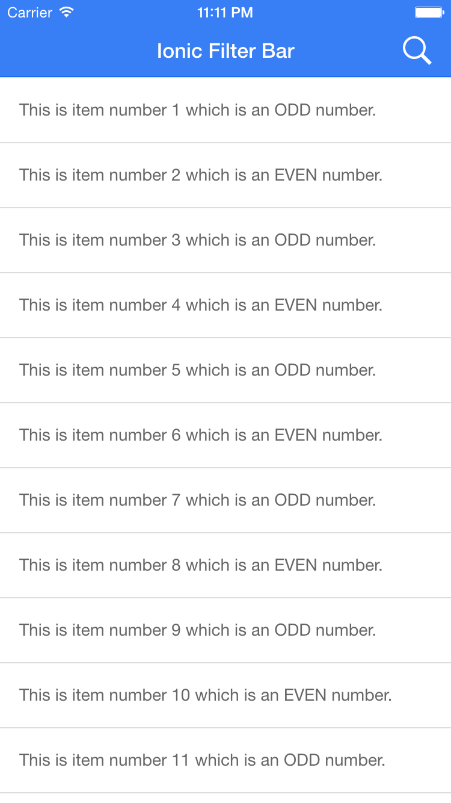
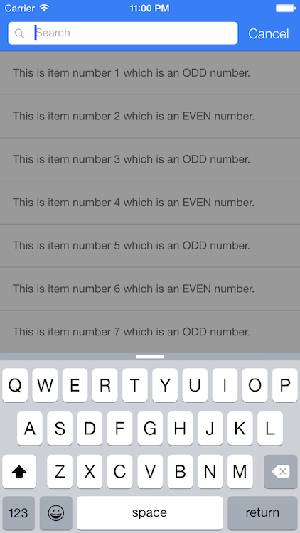
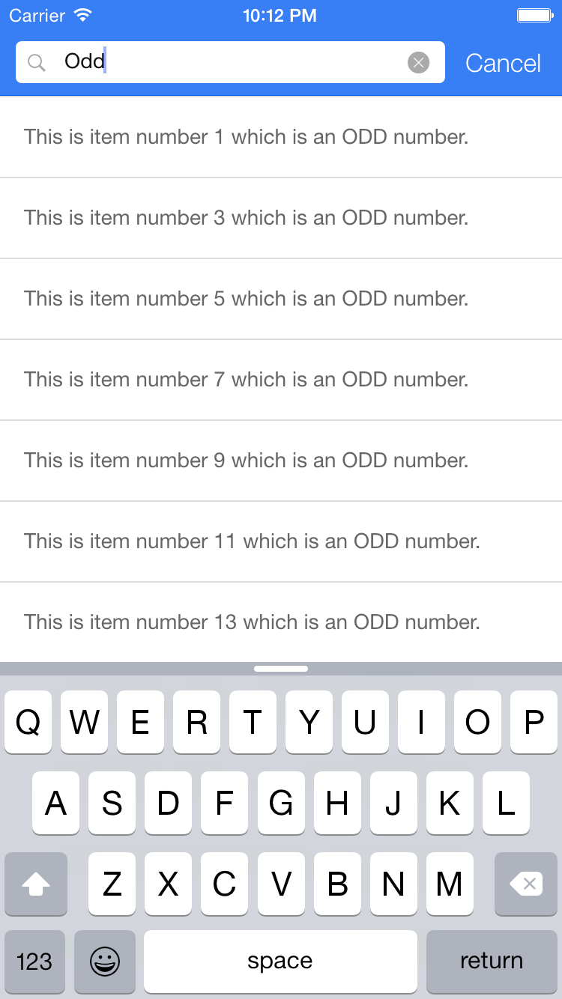
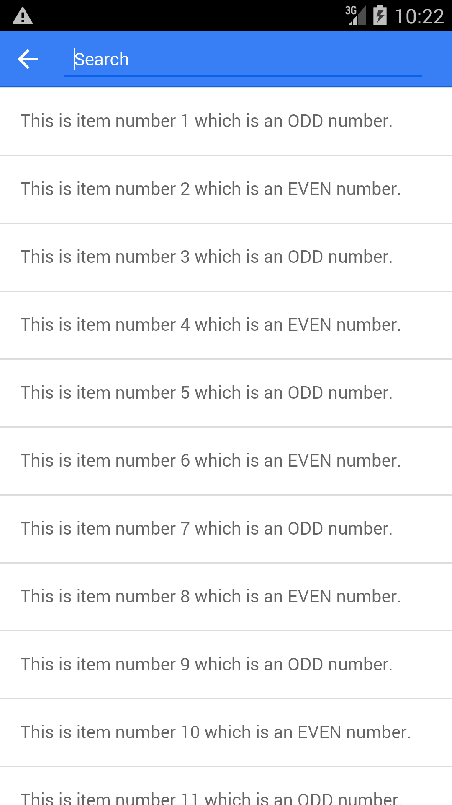
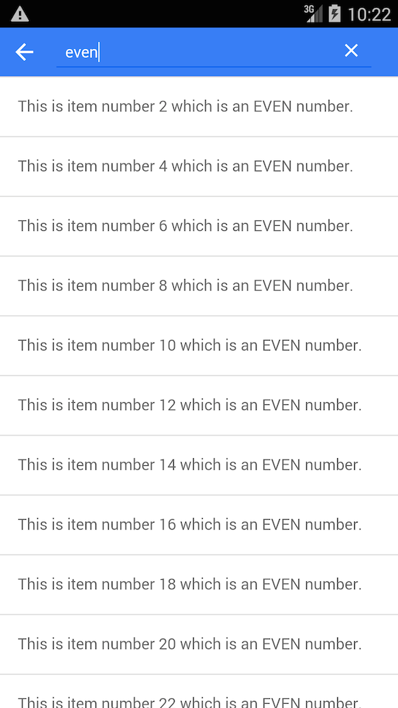

#Ionic Filter Bar
>A platform specific search filter plugin for the Ionic Framework (iOS / Android)

## Table of Contents
 - [Demo](#demo)
 - [Setup](#setup)
 - [Usage](#usage)
 - [Screenshots](#screenshots)

## Demo

- Download my sports news app **SportScoop** on iOS/Android to see it live!! [Web Demo](http://www.sportscoopapp.com) | [iOS](https://itunes.apple.com/us/app/sportscoop/id1035164619?mt=8) | [Android](https://play.google.com/store/apps/details?id=com.coseur.sportscoop)

- Watch the Demo video below

- Download the Demo app on [Ionic View](http://view.ionic.io/) with appId: `ab56e8bd`
  > NOTE:  On the Ionic View app, `KeyboardDisplayRequiresUserAction` is not being respected, therefore the autofocus that brings the keyboard up right away does not work.  This will work however on a real device
or emulator as long as the proper configuration has been setup (see Config section)

- Run the demo source code by cloning the ionic-filter-bar repo, navigating to /demo and running the following

Run the following ommands:

    npm install
    bower install
    gulp
    
## Setup

#### Install

`bower install ionic-filter-bar`

#### Cordova Keyboard config (config.xml)

In order for Ionic Filter Bar to autofocus for iOS and bring the keyboard up when the filter bar animates in,
you will need to add the following to your config.xml

    <platform name="ios">
        <preference name="KeyboardDisplayRequiresUserAction" value="false"/>
    </platform>

I also recommend using the [ionic-plugin-keyboard](https://github.com/driftyco/ionic-plugin-keyboard) and
disabling scroll for the keyboard as well.  See the app.js in the Demo for an example on how to configure the Ionic
Keyboard in your module's run section.

#### JS/CSS Imports (index.html)
Include the following JavaScript/CSS file imports in your index.html.  Remember to import the ionic libraries first!
The example below assumes your 3rd party bower dependencies are located in the default bower_components folder.
    
    <link rel="stylesheet" href="bower_components/ionic-filter-bar/dist/ionic.filter.bar.css">
    

#### Angular Dependency (app.js)
Add `jett.ionic.filter.bar` as a module dependency of your app module.

    angular.module('Demo', ['ionic', 'jett.ionic.filter.bar'])
      .config(function () {..});

#### SASS Import (main.scss)

Include the `scss/ionic.filter.bar.scss` file at the top of your `main.scss` file as shown below. Import any custom filter bar scss styles below the ionic and ionic.filter.bar scss.

    @import
      "path_to_bower_components/ionic/scss/ionic",
      "path_to_bower_components/ionic-filter-bar/scss/ionic.filter.bar";

## Usage

### $ionicFilterBarConfigProvider

A provider you can inject into your module config that provides a way to customize the filter bar template.

#### $ionicFilterBarConfigProvider.theme

  Allows you to override the ionic theme and color options used to style the filter bar.

  @param {string} value Ionic color option.

  By default the theme inherits the theme and color options of the ion-nav-bar (defaults to light theme).  For example, if you define a `bar-positive` class on you ion-nav-bar (see demo for example) then the filter bar will automatically have the filter-bar-positive styles.  You can override the default behavior by setting the theme to one of the following default Ionic themes listed below.

  - `light`
  - `stable`
  - `positive`
  - `calm`
  - `balanced`
  - `energized`
  - `assertive`
  - `royal`
  - `dark`

  @returns {string} value

#### $ionicFilterBarConfigProvider.clear

  filterBar Clear button icon used to clear filter input

  @param {string} value Android defaults to `ion-android-close` and iOS defaults to `ion-ios-close`.

  @returns {string}

#### $ionicFilterBarConfigProvider.search

  filterBar Search placeholder icon shown inside input only for iOS

  @param {string} value iOS defaults to `ion-ios-search-strong`.  Android doesn't show placeholder icons

  @returns {string}

#### $ionicFilterBarConfigProvider.backdrop

  filterBar backdrop which is shown when filter text is empty

  @param {boolean} value Android defaults to `false` and iOS defaults to `true`.

  @returns {boolean}

#### $ionicFilterBarConfigProvider.transition

  transition used when filterBar is shown over the header bar

  @param {string} value Android defaults to `horizontal` and iOS defaults to `vertical`.

  `platform`: Dynamically choose the correct transition depending on the platform the app is running from.
  If the platform is `ios`, it will default to `vertical`.  If the platform is `android`, it will default
  to `horizontal`. If the platform is not `ios` or `android`, it will default to `vertical`.

  @returns {string}

#### $ionicFilterBarConfigProvider.placeholder

  filterBar placeholder text shown inside input.

  @param {string} value defaults to `Search`.

  @returns {string}

#### $ionicFilterBarConfigProvider.favorite
  
  Icon shown in the input filed when `favoritesEnabled` is true and filter text is empty (same spot as clear button)
  
  @param {string} Android defaults to `ion-android-star` and iOS defaults to `ion-ios-star`.

  @returns {string}
    
#### $ionicFilterBarConfigProvider.close
  
  Icon used for button to close the modal
  
  @param {string} Android defaults to `ion-android-close` and iOS defaults to `ion-ios-close-empty`.

  @returns {string}
  
#### $ionicFilterBarConfigProvider.done
  
  Icon used to when a user is done reordering filter bar favorites
  
  @param {string} Android defaults to `ion-android-done` and iOS defaults to `ion-ios-checkmark-empty`.

  @returns {string}
  
#### $ionicFilterBarConfigProvider.remove
  
  Icon for the item options delete button used to delete a favorite
  
  @param {string} Android defaults to `ion-android-delete` and iOS defaults to `ion-ios-trash-outline`.

  @returns {string}
  
#### $ionicFilterBarConfigProvider.reorder
  
  Icon used for the reorder button
  
  @param {string} Both platforms default to `ion-drag`.

  @returns {string}
      
#### $ionicFilterBarConfigProvider.add
  
  Icon used for the add button
  
  @param {string} Both platforms default to `ion-ios-plus-outline`.

  @returns {string}      
    
### $ionicFilterBar

A service you can inject in your controller to show the filter bar

#### $ionicFilterBar.show

  Load and return a new filter bar.  A new isolated scope will be created for the filter bar and the new filter bar
  will be appended to the body, covering the header bar.

  @returns {function} `hideFilterBar` A function which, when called, hides & cancels the filter bar.

  @param {object} options The options for the filterBar. Properties:

         
  - `[Object]` `items`

    The array of items to filter.  When the filterBar is cancelled or removed, the original list of items will
    be passed to the update callback.

  - `{function=}` `update`

    Called after the items are filtered.  The new filtered items will be passed to this function which can be used
    to update the items on your controller's scope.  The text string that was searched on will be passed as the 
    second argument.

  - `{function=}` `cancel`

    Called after the filterBar is removed.  This can happen when the cancel button is pressed, the backdrop is
    tapped or swiped, or the back button is pressed.

  - `{function=}` `done`

    Called after the filterBar is shown.

  - `{object=}` `scrollDelegate`

    An $ionicScrollDelegate instance for controlling the items scrollView.  The default value is $ionicScrollDelegate,
    however you can pass in a more specific scroll delegate, for example
    $ionicScrollDelegate.$getByHandle('myScrollDelegate').

  - `{object=}` `filter`

    The filter object used to filter the items array.  The default value is $filter('filter'), however you can also
    pass in a custom filter.

  - `{function=}` `expression`

    The predicate to be used for selecting items from the `items` array.  This is similar to the angular filter 
    `expression` function described [here](https://docs.angularjs.org/api/ng/filter/filter), except that the first 
    argument will be the filterText as shown below.  Default value is `null`.
    NOTE: This property will take precedence over `filterProperties`.  Only one can be defined.
    
      function (filterText, value, index, array) {
        return value.propertyName === filterText || value.anotherPropertyName === filterText;
      }

  - `{function,true,false,undefined=}` `comparator`

    Determines if the expected value (from the filter expression) and actual value (from the object in the array) 
    should be considered a match.  This is the same as the angular filter `comparator` argument described [here](https://docs.angularjs.org/api/ng/filter/filter).  
    Default value is `undefined`.
    
  - `[String]` `filterProperties`

    A string or string array of object properties that will be used to create a filterExpression object for
    filtering items in the array.  All properties will be matched against the input filter text.  For example, given 
    the following object in an array of items , and assume the user searches for "fish"
    
        {name: 'fish', description: 'fish', color: 'blue'}
        
        filterProperties: ['name', 'description'] ... The object will be matched and passed to the array in `update`
        filterProperties: ['name', 'color']       ... The object will NOT be matched or passed to the array in `update`
    
    NOTE: If `expression` is defined, `filterProperties` will have no effect.  Only one can be defined.  Default
    value is null.

  - `{boolean=}` `debounce`

     Used to debounce input so that the filter function gets called at a specified delay, which can help boost
     performance while filtering.  Default value is false

  - `{number=}` `delay`

    Number of milliseconds to delay filtering.  Default value is 300ms.  The debounce option must be set to true
    for this to take effect.

  - `{string=}` `cancelText`

    The text for the iOS only 'Cancel' button.  Default value is 'Cancel'.

  - `{boolean=}` `cancelOnStateChange`

    Whether to cancel the filterBar when navigating to a new state.  Default value is true.

  - `{string=}` `container`

    The parent container to append the filter bar to.  The default container is the HTML `body`, however this can be
    customized by passing in the following supported container classes

    - `.modal` (Appends to a modal)
    - `.menu-content` (Appends to the content section of a side menu.  Useful when the expose-aside-when attr is set.)

##### NOTE: The favorites feature is not stable.  There is a bug with the keyboard/input focus that needs to be resolved

  - `{string=}` `favoritesEnabled`

    Toggles the favorite searches feature.  If true, a user will be able to see a list of favorite search terms.
    Default value is 'false'.

  - `{string=}` `favoritesTitle`
 
    The header bar title for the favorites modal.  Default value is 'Favorite Searches'.
   
  - `{string=}` `favoritesAddPlaceholder`
  
    The placeholder for adding a new search term.  Default value is 'Add a search term'.
  
  - `{string=}` `favoritesKey`
  
    The key used for saving search terms in local storage.  Default value is 'ionic_filter_bar_favorites'.
  
            
## Screenshots

